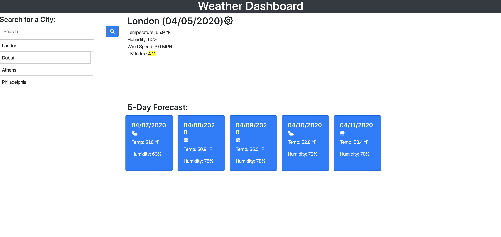

Weather Dashboard

## Project Descritpion

This website allows you to enter the name of any cty and get a 5 day forecast. In adition to that you also can see the full date, the temperature, wind speed and UV index. Some of those info also show in seperate blue colored icons, one for each of the 5 days.

### Screenshots

### How to access the quiz
URL:  https://k3vindi3s3l.github.io/K3vinDi3s3l.weatherdasboard.io/
 
URL: https://k3vindi3s3l.github.io/k3vindi3s3l.weatherdasboard.io/

### Built With

* HTLM (https://developer.mozilla.org/en-US/docs/Glossary/HTML#Concept_and_syntax)
* Jacascript (https://developer.mozilla.org/en-US/docs/Web/JavaScript)
* CSS (https://www.w3schools.com/css/)